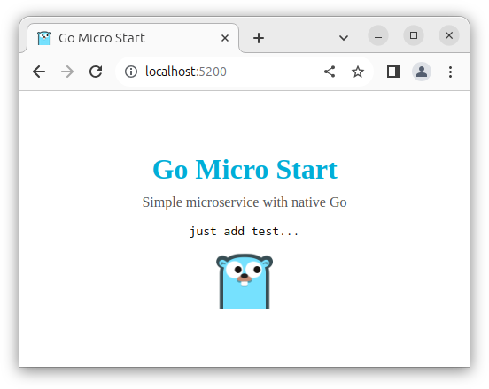

# Micro Start Go

Simple microservice with native Go.

Based on `golang:1.20-buster`. Built image: `28.5 MB`;
```shell
# run this command to start
make d-up
```

### URL addresses
- main page: `/`
- simple api: `/api`
- static file: `/download/some.txt`

> Just **_click on the logo_** to download a static file.



## Analogs
- Node.js Vanilla: [micro-start-node](https://github.com/phacman/micro-start-node)